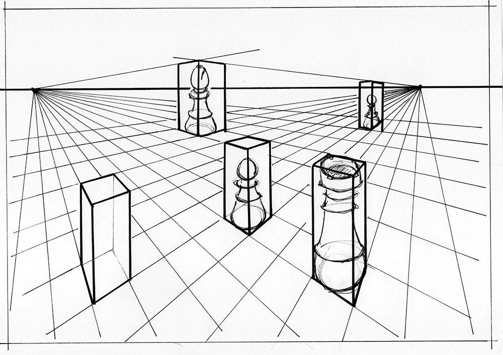
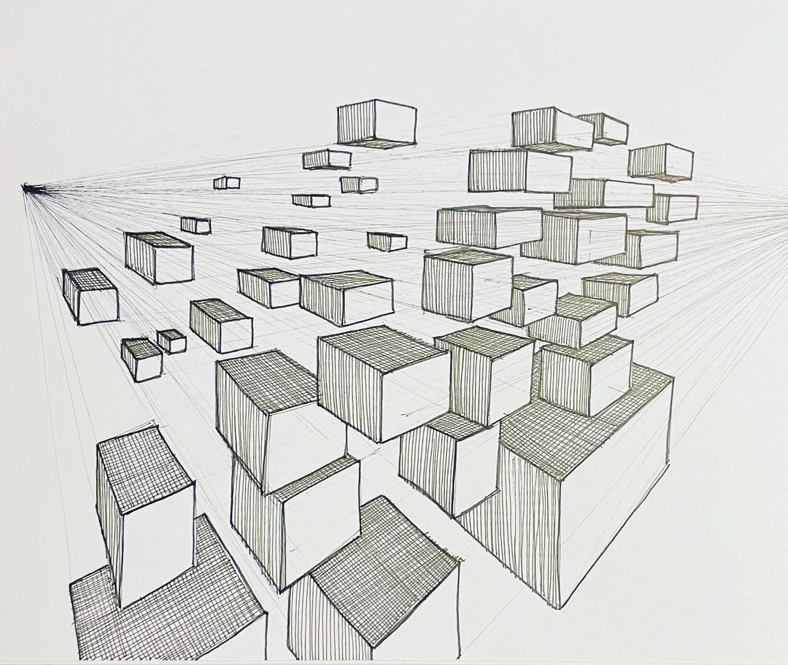

# Perspecto

### Disclaimer:
The game above (or below) is to be considered as merely a proof of concept rather than a finished product or even a particularly interesting prototype. Please treat is as an embodiment of an idea rather than a game. However, most formal game attributes are present. 

### Goal of the game:
You are given a set of 2d-shapes or rendered objects that are presented as thumbnails on the right side of the screen. These objects are 2d-images as if they were drawn or rendered with a perpective projection (i.e. normal perspective) in mind;

However, their initial position in picture is lost. You need to rearrange them **spatially** inside the screen in a way that resulting composition corresponds to the rules of projection, i.e. all the non-parallel lines should converge towards a Vanishing point. 
For your convenience you are provided with a horizon line and points where you hit them. Ideally these should converge to a single point or two points.
The better the convergence - the better the **lower** score you get. Once you pass the minimal score, you may proceed to the next level (or hack your way there trivially by observing the logic in file `main.py`).
Each object has a `layer` attribute that governs the order of rendering of the image and does not affect the score of the composition. You may use it for convenient depiction of the objects in the natural order (that is, the order that they would appear in an initial image).

### Controls:
`Left Mouse button` - for picking objects:
- `-` - to decrease the current `Layer` number
- `=` - to increase the current `Layer` number
- `R` - to restart the current level.

### Examples:
For the sake of competitiveness the examples are not the actual game screenshots but pictures that demonstrate the principle.

### Assets:
One of the levels was produced with the help of the [greatest building generator](https://paveloliva.gumroad.com/l/buildify)

